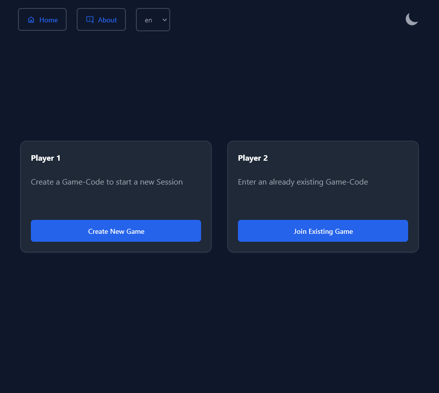
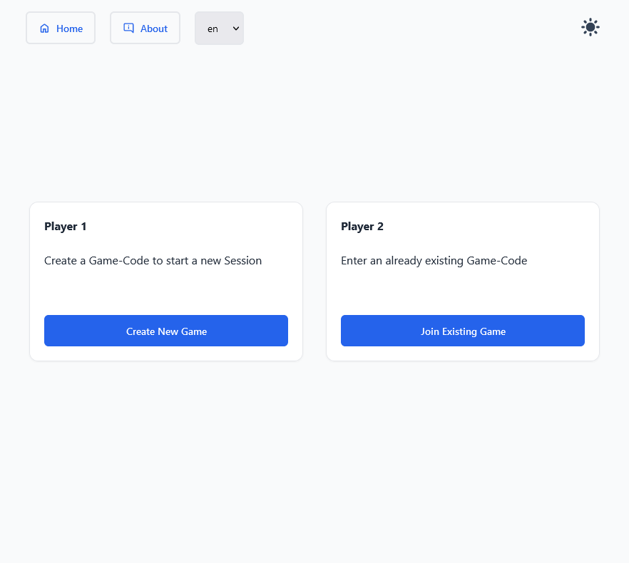
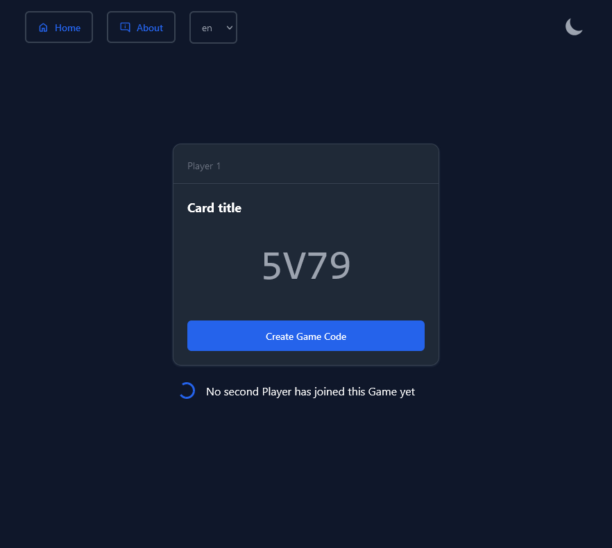
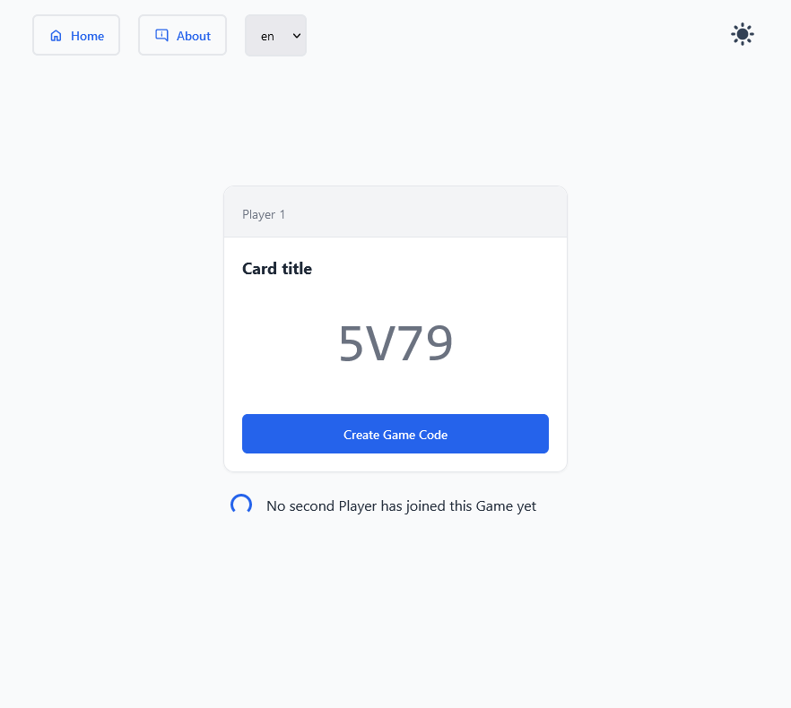
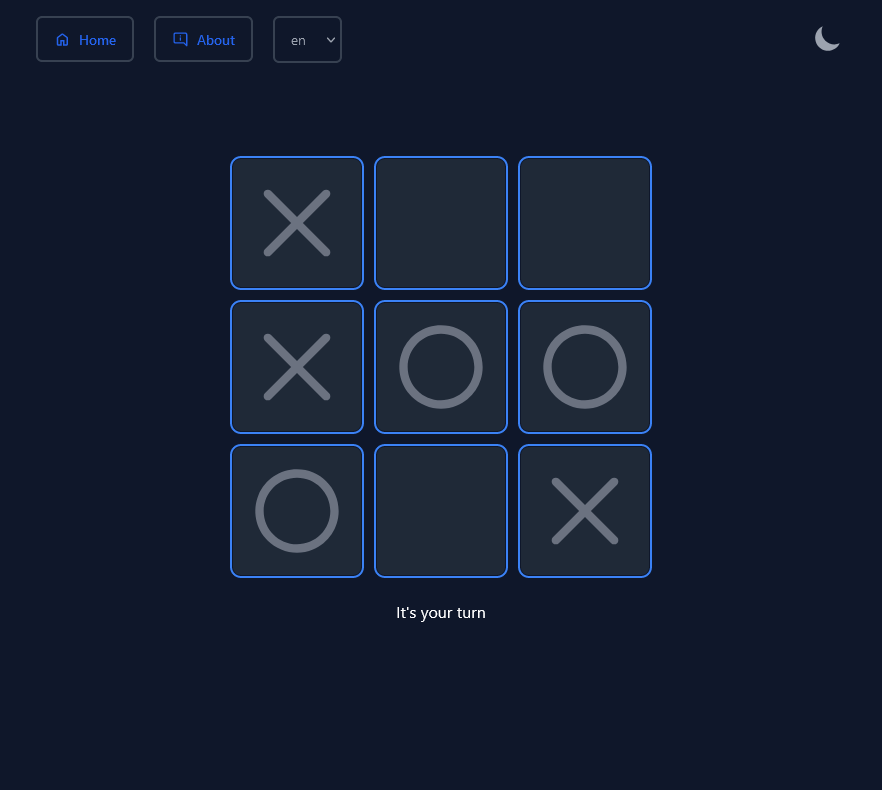
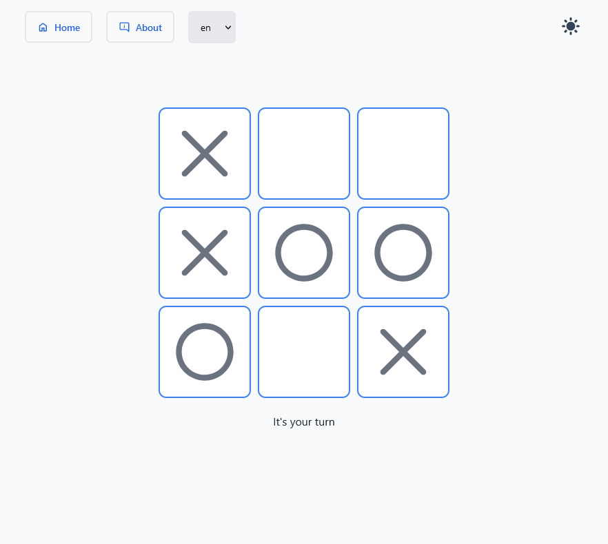

# *TicTacToe*

## Description
A fully working online TicTacToe Multiplayer Game 

## Technology Stack
- Backend
    - [Ktor](https://ktor.io/)
- Frontend
    - [Vue.js](https://vuejs.org/)
    - [TailwindCSS](https://tailwindcss.com/) + [Preline UI](https://preline.co/)
- Deployment
    - [Docker](https://www.docker.com/)

## Deployment
```shell
docker pull ghcr.io/nikita-t1/tictactoe:latest
```
Then run with:
```shell
docker run -p 8080:8080 ghcr.io/nikita-t1/tictactoe
```

## Development
1. [Clone this repo](https://help.github.com/en/articles/cloning-a-repository) with git.
2. Open a terminal window an run the following command to start the backend ```gradle run```
3. Open a second terminal window and navigate into the frontend directory ```cd frontend```
   1. Install dependencies by running ```npm install```
   2. Start the frontend with ```npm run dev```


## Background & Motivation
The Goal of this Project is for me to learn new technologies and tools.  
This includes:
- First time using `WebSockets`
- Getting more familiar with `Vue.js`
- Getting more familiar with `TailwindCSS` and `CSS` in general

## Screenshots
| Dark                                  | Light                                  |
|---------------------------------------|----------------------------------------|
|         |         |
|  |  |
|         |         |

## Credits
 [The favicon was created by Freepik](https://www.flaticon.com/free-icon/tic-tac-toe_434849)


